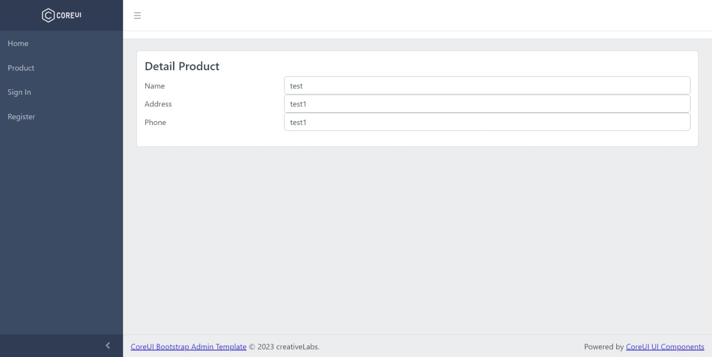

# samplecrud.auth.netcore6.monggodb

home layout it can be access without authorization

home layout it can be access without authorization and on this page you can login with user

home layout it can be access without authorization and on this page you'r registering or creating new user with default role member

list of product layout , you should login first to access this page

edit of product layout , you should login first to access this page

delete spesific of product layout , you should login first to access this page

details information of spesific product layout , you should login first to access this page

if there error occured like this image bellow, is it because there are no value on connectiong string for fixing it just make sure you fill with your correct connection string and the name of database

monggo db preview database

monggo db table product

monggo db table user

monggo db table role

this is application developed using visual studio 2022 and combine with .net core 6 as frontend and backend the databases it self using monggo db, and also support docker.

if you want to clone this make sure restore the nugget if you have some trouble kindly email me on ibnu.hz@outlook.com i will reply if i have free time.

it also using multiple layout, fully flexible and customize

this project are being used on all my project if the user want to use monggo db as databases and authentication
if you want to see all my project kindly visit this website https://ibnuhzjs.azurewebsites.net

docker public repository https://hub.docker.com/repository/docker/meizoel/h.znet/general